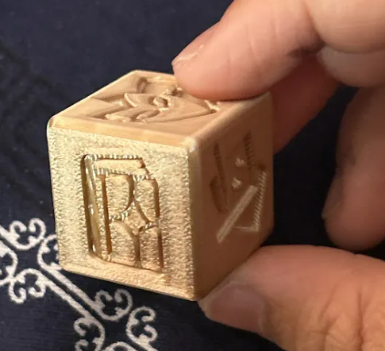
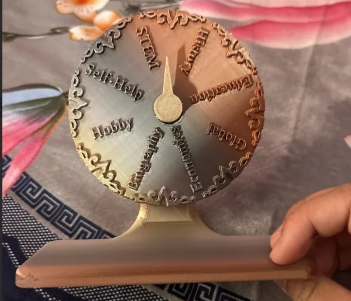
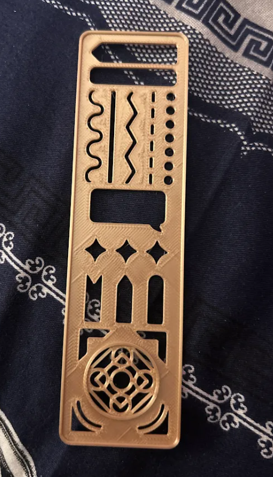
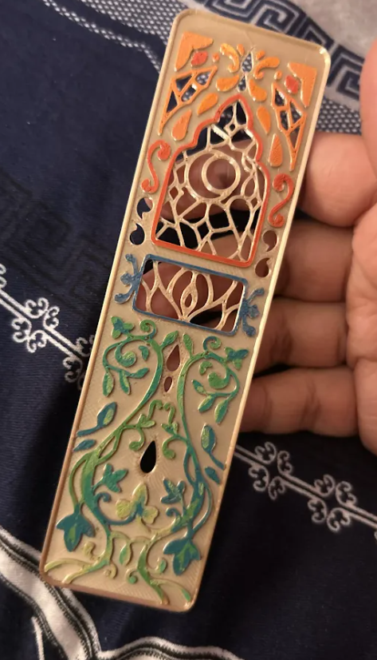
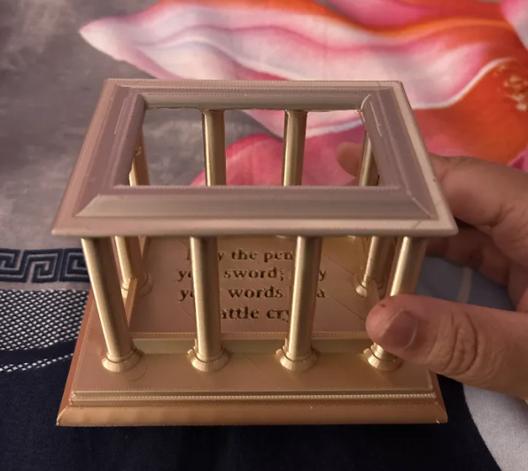
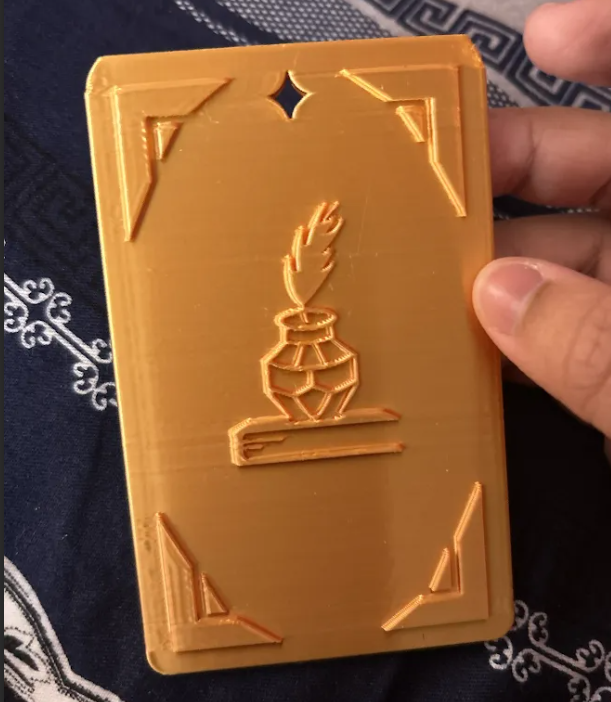
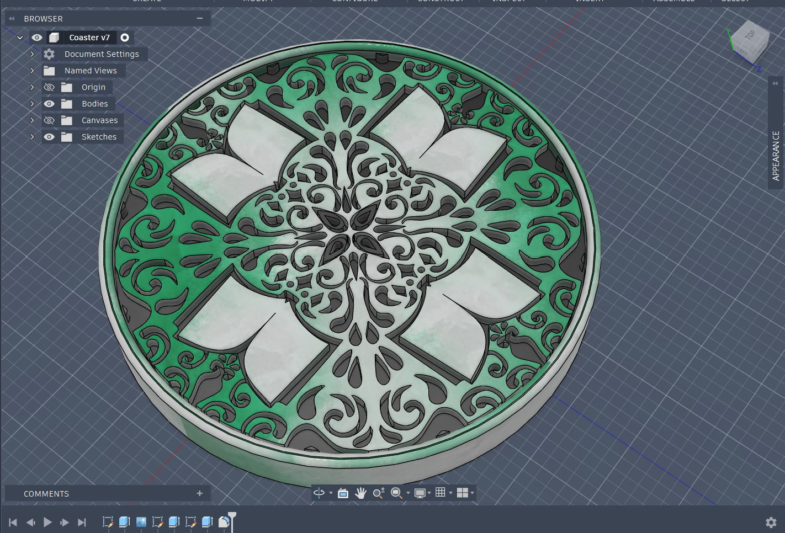

# The Write-A-Thon Kit
## AKA, The ULTIMATE WRITER'S KIT!

Are you a writer tired of having bland bookstands, with no inspiration in your homes for your lengthy tomes? Welcome to :sparkles: WRITE-A-THON, the ultimate (7-piece) writing kit full of fun essentials for you to write a ton! :sparkles:

From one writer to another, I've always been a bit indecisive when it comes to actually finding what piece I want to write. Maybe you've been too! So with these hand-designed desk items, I hope you can streamline your writing process by making it FUN and INSPIRATIONAL!

### Demo-url: 
Watch me [play with the kit](https://www.youtube.com/watch?v=tLPsY6LvASI)!

### The Writer's Checklist
1. Dice-deas
2. The Wheel Deal
3. The Writer's Bookmark
4. The Reader's Bookmark
5. The Arsenal
6. The ID-spiration
7. The Writer-Coaster

## How to Use the Files
### Method One
1. Download the full repo by clicking on <>CODE
2. Download the ZIP file
3. Extract all the files
4. Put the STL files you want to print into your favorite 3D printer studio / slicer software!

### Method Two
1. Click onto the stl_files folder
2. Pick the STL files you want to print
3. Download them individually
4. Put the STL files you want to print into your favorite 3D printer studio / slicer software!

## Items, Print Settings, and Printed Results
### Dice-deas
Can't choose if you wanna write a short story, play, novel... anything? Use Dice-deas, the ultimate die to give you the best writing ideas :D Just roll to see your fate!

#### Symbol Key:
1. gavel: journalism / article
2. mask: play / scriptwriting
3. pages: short story
4. book: novel
5. quotation marks: essay
6. inkwell + quill: poetry

#### Print Settings
- No supports
- 15% infill, 45 degree direction
- 0.2 mm layer height
- 50 mm/s, initial layer speed
- 200 mm/s, outer wall speed
- 300 mm/s, inner wall speed

#### Result:

---

### The Wheel Deal
Want a genre to use with your medium, chosen by Dice-deas? Use the WHEEL DEAL! Here, you can flip the wheel to fiction or nonfiction, and find genres for each subtype. Keep the spinner oriented towards the top, then grip the wheel, and spin!

#### Genre Key
*Fiction*:
- Mystery + thriller + action
- Romance
- Sci-fi
- Fantasy
- Drama
- Slice of life / contemporary
- Historical
- Comedy

*Nonfiction*: 
- STEM (science, tech, engineering, math)
- Self-help 
- Hobby (arts, photography, carpentry... literally any piece about a hobby)
- Educational
- Biography (or autobiographies + memoirs)
- Economics
- Global (travel, international news)
- History + political sciences

#### Print Settings
- Default tree supports enabled
- Infill: 7 for the wheel, 15 for the wheel stand + spin indicator
- 0.2 mm layer height
- 50 mm/s, initial layer speed
- 200 mm/s, outer wall speed
- 300 mm/s, inner wall speed

#### Result:

---

### The Write-mark
Literally just a bookmark with a bunch of stencils for when you edit your manuscript!

#### Print Settings
- No supports
- 15% infill, 45 degree direction
- 0.2 mm layer height
- 50 mm/s, initial layer speed
- 200 mm/s, outer wall speed
- 300 mm/s, inner wall speed

#### Result:

---

### The Read-mark
Pretty fancy bookmark for you to feel GLAMOROUS as you read!

#### Print Settings
- No supports
- 15% infill, 45 degree direction
- 0.2 mm layer height
- 50 mm/s, initial layer speed
- 200 mm/s, outer wall speed
- 300 mm/s, inner wall speed

#### Result:

---

### The Arsenal
A pen holder that's shaped like a battle ring / arena / or temple. I mean, they all describe words, no? For you to store humanity's greatest weapon---the pen. Comes with a quote of mine at the bottom!

#### Print Settings
- Default tree supports enabled (PLEASE!)
- 10% infill, 45 degree direction
- 0.2 mm layer height
- 50 mm/s, initial layer speed
- 200 mm/s, outer wall speed
- 300 mm/s, inner wall speed

#### Result:

---

### The ID-spiration
How can you show off your writing without an ID? Use this fancy, writer-made ID holder, with a pretty quill pen resting atop a book at the back. Sleek, easy to use, and super durable.

#### Print Settings
- No supports
- 15% infill, 45 degree direction
- 0.2 mm layer height
- 50 mm/s, initial layer speed
- 200 mm/s, outer wall speed
- 300 mm/s, inner wall speed

#### Result:

---

### The Writer-Coaster
It might be 3PM when you're writing, it might be 3AM! Be sure to always have your cup of coffee, tea, whatever it is on hand, or... on this fancy little coaster! With book decals and swirling, floral motifs, it's perfect for you to drown in your little writer world.

#### Print Settings
- No supports
- 15% infill, 45 degree direction
- 0.2 mm layer height
- 50 mm/s, initial layer speed
- 200 mm/s, outer wall speed
- 300 mm/s, inner wall speed

#### Result:

